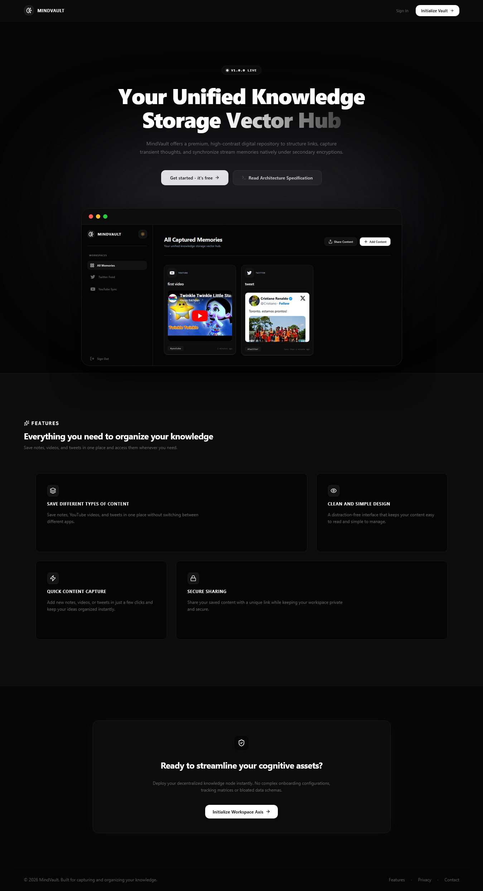
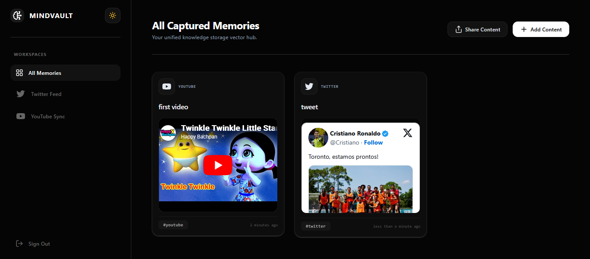
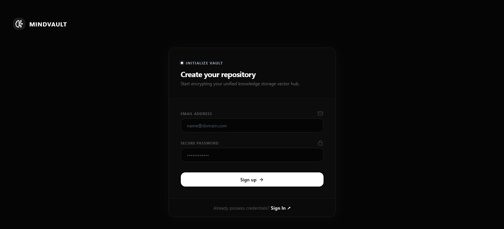
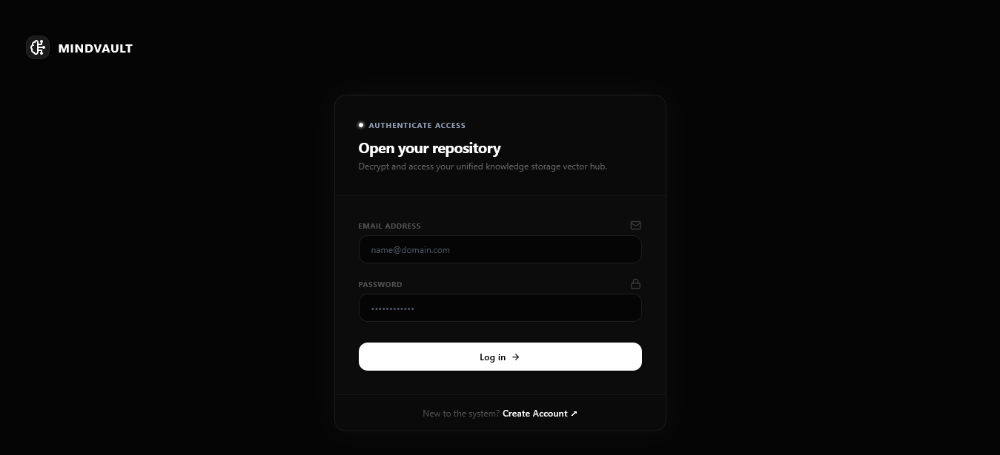

# 🧠 MindVault

A modern **Second Brain** application to capture, organize, and share your digital knowledge. Store YouTube videos, Twitter/X posts, and personal notes in one place, then access them anytime through a clean, responsive interface.

---

## 📸 Screenshot

<table align="center">
<tr>
  <th>Home Page</th>
  <th>Content Page</th>
</tr>
<tr>
  <td align="center">
    
  </td>
  <td align="center">
    
  </td>
</tr>
</table>

<br/>

<table align="center">
<tr>
  <th>Signup page</th>
  <th>Signin page</th>
</tr>
<tr>
  <td align="center">
    
  </td>
    <td>
        
    </td>
</tr>
</table>

---

## 🌐 Live Demo

The project is live and can be viewed here:

[MINDVAULT](https://mind-vault-gules.vercel.app/)

---

## ✨ Features

- 📝 Create and organize personal notes
- 🎥 Save YouTube videos
- 🐦 Store Twitter/X posts
- 🔍 Filter content by category
- 🔗 Share your complete MindVault with a unique public read-only link
- 🌙 Dark & Light mode support
- 📱 Fully responsive design for desktop and mobile
- 🔒 Secure JWT Authentication
- ⚡ Fast and intuitive user experience
- 🔔 Beautiful toast notifications
- 🎨 Clean UI with Lucide React icons

---

## 🛠️ Tech Stack

### Frontend
- React
- TypeScript
- Vite
- Tailwind CSS
- React Router DOM
- Lucide React
- React Hot Toast
- date-fns

### Backend
- Node.js
- Express.js
- TypeScript
- MongoDB
- Mongoose
- JWT Authentication
- bcrypt
- nanoid

---

## 📂 Project Structure

```text
MindVault/
├── frontend/
│   ├── src/
│   ├── public/
│   └── ...
│
└── backend/
    ├── src/
    ├── routes/
    ├── middleware/
    └── ...
```

---

## 🚀 Getting Started

### 1. Clone the repository

```bash
git clone https://github.com/aru-shi2/MindVault.git
cd MindVault
```

### 2. Install dependencies

#### Frontend

```bash
cd frontend
npm install
```

#### Backend

```bash
cd backend
npm install
```

---

## 🔑 Environment Variables

### Frontend (`frontend/.env`)

```env
VITE_BACKEND_URL=http://localhost:3000
```

### Backend (`backend/.env`)

```env
MONGO_URL=your_mongodb_connection_string
JWT_SECRET=your_secret_key
PORT=3000
```

---

## ▶️ Running Locally

### Backend

```bash
cd backend
npm run dev
```

### Frontend

```bash
cd frontend
npm run dev
```

---

## 🌐 Deployment

| Service | Platform |
|---------|----------|
| Frontend | Vercel |
| Backend | Render |
| Database | MongoDB Atlas |

---

<p align="center">
Made with ❤️ using React, TypeScript, Node.js, Express, MongoDB, Tailwind CSS, Lucide React, and React Hot Toast.
</p>
